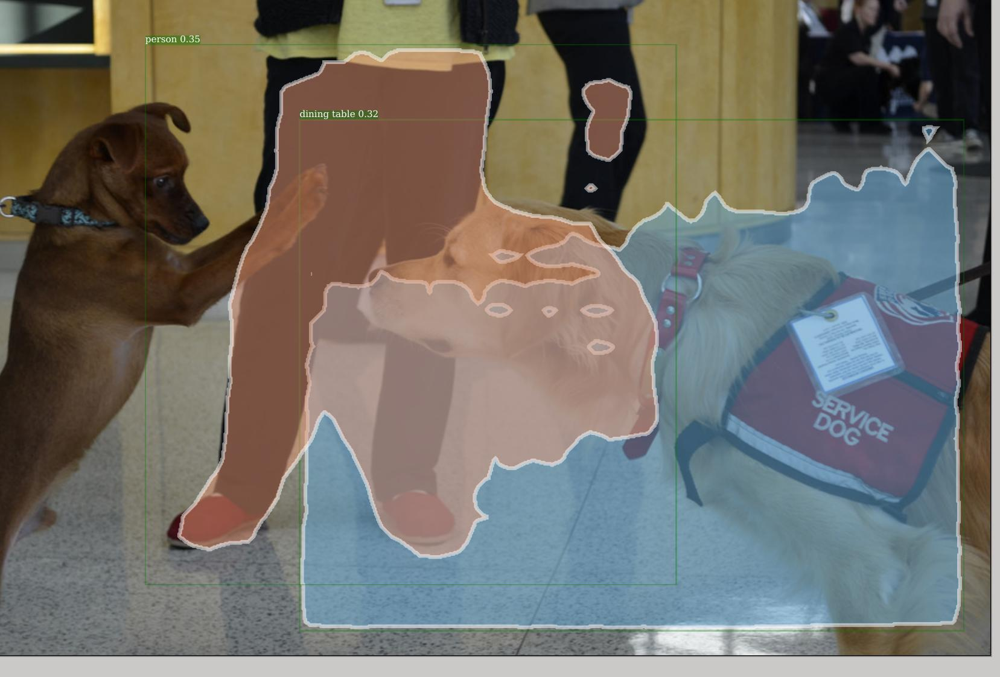
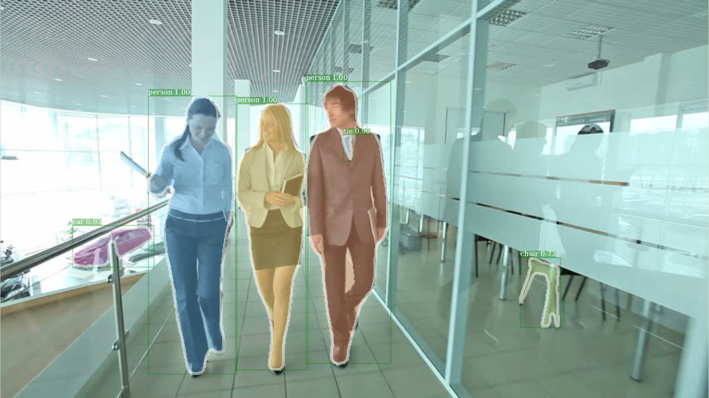
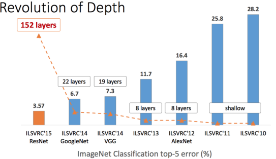

# Object Detection and Segmentation using different Backbone Architectures and training Datasets
**Team Members: Srikanth Kilaru, Michael Wiznitzer, Solomon Wiznitzer**

Northwestern University ME 349: Machine Learning (Spring 2018)

## Abstract

Object detection is the process of finding instances of real-world objects such as faces, bicycles, and buildings in images or videos. Object detection algorithms typically use extracted features and learning algorithms to recognize instances of an object category. It is commonly used in applications such as image retrieval, robotics, security, surveillance, and advanced driver assistance systems (ADAS). Object detection and segmentation is an area of significant R&D activity in both academia and industry. Facebook AI Research (FAIR) Labs open sourced their latest object detection and segmentation algorithm, code named Detectron, in the interest of attracting more users and contributors for these algorithms.

## Task
We leveraged the modular nature of the Detectron code base to replace the default backbone from ResNet50 / ResNet101 to a backbone that is not already provided in their 'model zoo'. We added a new backbone, the Google Inception_ResNet_v2 CNN to the model zoo, which was implemented in python utilizing Caffe2, and tested the object detection and segmentation capabilities of the model when trained on the PASCAL VOC 2012 & MS COCO dataset. Inference produces images that are overlaid with segmentation mask and bounding box of the object instances along with their classification and associated confidence level.

## Results
Detectron with Inception as a backbone did not perform as well as with Resnet. Some of the images could not be infered at all, even incorrectly, after lowering the (srikanth fill the right word here) thresh, from a default of 0.7 to 0.3, and the keypoint threshold from a default of 2 to 0. This shows that the algorithm is tuned to throw away low qaulity inferences. In addition the lack of the FPN feature (please see detailed report) in our testing could have contributed to the low accuracy of the inference.

## Further background and Detailed Report

Deep Learning (CNN) architectures such as AlexNet, VGG, Resnet and Inception have proven to be very successful in image classification tasks. However they were not particularly useful for object detection. A key advance in the area of object detection and segmentation has been the work done by some researchers who now work at Facebook.

To increase the accuracy and performance of object detection algorithms, these researchers, introduced a Region Proposal Network (RPN) that shares full-image
convolutional features with the main detection network (also refered to as the 'backbone'), thus enabling nearly cost-free region proposals. An RPN is a fully convolutional network that simultaneously predicts object bounds and objectness scores at each position. The RPN is trained end-to-end to generate high-quality region proposals, and then merge the RPN and CNN into a single network by sharing their convolutional features. The RPN portion tells the unified network where to look.

A further enhancement made in the last 18 months was the development of the FPN. 
Feature pyramids are a basic component in recognition systems for detecting objects at different scales. But many deep learning object detectors have avoided pyramid representations, in part because they are compute and memory
intensive. But the FAIR team exploits the inherent multi-scale pyramidal hierarchy of deep convolutional networks to construct feature pyramids with marginal extra cost. A topdown architecture with lateral connections is developed for
building high-level semantic feature maps at all scales. This architecture is called a Feature Pyramid Network (FPN), and it has shown significant improvement as a generic feature extractor in several applications.

The modular nature of the Detectron code base enabled us to replace the default backbone from ResNet50 / ResNet101 to a VGG or any other backbone that is not
already provided in their 'model zoo'. We added a new backbone, the Google Inception_ResNet_v2 to the model zoo. The way the FPN feature part of Detectron is currently developed, it makes it extremely challenging to plugin non-ResNet models(like VGG and Inception) to the FPN. Therefore we turned off the FPN feature when testing the Inception module. Our results show that with a new previously untested backbone and with the FPN off, the object detection capabilities of the model when trained on the MS COCO dataset is marginal.

Some sample images with object detection and segmentation working correctly when Detectron uses the Inception backbone and is trained on the MS COCO dataset -

  
Example 1: Detectron output.
 

  
Example 2: Detectron output.
 

  
Example 3: Detectron output.
 

Some sample images with object detection and segmentation NOT working correctly when Detectron uses the Inception backbone and is trained on the MS COCO dataset -

  
Example 1: Detectron output.
 

Some sample images with object detection and segmentation working very marginally or missing detection of significant (number of) objects in the image -

  
Example 1: Detectron output.
 

For trying out inference with your own set of images, you can use the weights from the trained model located at ().

## Future Work
In the future we would like to rewrite the interface between FPN and non-ResNet backbones so that it is much easier to plug in these backbones without giving up FPN functionality. This would enable us to do a fair comaprison with the results published by the FAIR team.

## Setup and Installation Instructions

### Setting up the GPU enabled VM on Google Cloud Platform (GCP)

One of the requirements of Detectron is to use a machine with NVIDIA GPUs. To gain access to this resource, we each created free accounts on [Google Cloud](https://cloud.google.com/) using our *personal* email addresses and credit cards. Unfortunately, the free version (although it does give $300 credit for the first year) does not allow access to GPUs so we upgraded our accounts, albeit at no up front charge. We then followed the instructions [here](https://cloud.google.com/compute/quotas) to get access to 8 up to K80 GPUs.

After creating a project, we then made a VM Instance with the following settings:
* **Zone:** us-central or us-west
* **Machine type:**
    * *Cores:* 4 vCPUs
    * *Memory:* 20 GB memory
    * *GPU:* 1,2, or 8 K80 GPUS
* **Boot Disk:** 
    * *OS Image:* Ubuntu 16.04 LTS
    * *Boot Disk Type:* Standard persistent disk
    * *Size:* 500 GB
* **Firewalls** - Allow HTTP and HTTPS traffic

*Note: During the course of the project, we used either 1, 2, or 8 GPU K80s for model training. Addtionally, we chose to use Ubuntu Linux 16.04 as the OS image since all of us are familiar with it. Finally, we decided to use a standard persistent disk with 500 GB storage since this was cheaper than a solid-state drive and would be able to store the [PASCAL VOC image dataset](http://host.robots.ox.ac.uk/pascal/VOC/voc2012/index.html#devkit) as well as the [COCO dataset](http://cocodataset.org/#download).*

Finally, we installed the [Google Cloud SDK](https://cloud.google.com/sdk/docs/quickstart-debian-ubuntu) on our *local* machines and followed the instructions [here](https://cloud.google.com/sdk/gcloud/reference/compute/scp) so that we could copy files (specifically classified/inferred images) from the VM to our laptops.

### Detectron

After booting up the VM instance, we followed the directions outlined in [Detectron's repo](detectron/INSTALL.md) to install [Caffe2](https://caffe2.ai/docs/getting-started.html?platform=ubuntu&configuration=compile) from source, some standard Python packages, and the COCO API. During installation, we found (after countless hours of debugging) some issues that we fixed as follows:
* In the 'Install Dependencies' section on the Caffe2 'Install' page, we added `python-setuptools` to the `sudo apt-get install` command.
* In the 'Install cuDNN (all Ubuntu versions) section on the Caffe2 'Install' page, instead of registering to get the Version 6.0, we just switched all appearances of `v5.1` in the gray command window to `v6.0` which worked just fine.
* When doing the `sudo make install` in the 'Clone & Build' section of the Caffe2 'Install' page, we added the flag `-DUSE_MPI=OFF` so that the final command was `sudo make install -DUSE_MPI=OFF`.
* After the installation (which took a little over an hour), but before checking to see if the Caffe2 installation was successful, we edited the `bash.rc` file to update the `PYTHONPATH` environment variable to `export PYTHONPATH="/home/<user>/pytorch/build/"`

The above tweaks took many hours to figure out but once completed, the check to determine whether or not Caffe2 installed properly outputted 'Success'.

### VNCServer

In order to easily browse the internet for image datasets and look through the Home Folder, we installed a VNCserver by following the instructions [here](https://cloudcone.com/docs/article/install-desktop-vnc-ubuntu-16-04/). For clients, we just installed any VNC client like the Remmina Remote desktop client, VNCViewer, or KRDC.

Also, we made a firewall rule in the GCP to allow communication between the server and the client as outlined in the 'Open the firewall' section [here](https://medium.com/google-cloud/graphical-user-interface-gui-for-google-compute-engine-instance-78fccda09e5c).

### Initial Test

For fun, we tested a pretrained Mask R-CNN model using a ResNet-101-FPN backbone on some test images provided by Detectron as well as an image we randomly found online. We ran the code shown under option 1 [here](/detectron/GETTING_STARTED.md). The result which correctly classified a number of people, a tie, a car, and a chair can be seen below.

## Resnet vs. VGG vs. Inception

From the paper titled [Deep Residual Learning for Image Recognition](https://www.cv-foundation.org/openaccess/content_cvpr_2016/papers/He_Deep_Residual_Learning_CVPR_2016_paper.pdf) by Kaiming He, et al, the authors describe that in theory, a neural network should have reduced training error as the number of layers inrease. This is because  increased depth enables the network more opportunity to learn complex features. While this is true to a certain extent (VGG16 outperforms an AlexNet due to having multiple layers of 3x3 convolution filters), it is not completely accurate. Rather, a 'plain' network (similar to VGG) tends to increase in training error if the number of layers is too big. In contrast, training error continues to decrease as the number of layers increase by ResNet. To achieve this, a 'shortcut' is created between an input to a hidden layer and right before an output a second layer down (as shown in the image below).

Not only does this address the vanishing gradient issue to a certain extent (since an output layer will at the very least be equal to its previous residual), it also allows the network to set weights to equal zero if the residual is optimal or set the weights to find small fluctations around the residual (a.k.a the identity). Furthermore, at the [2016 Conference on Computer Vision and Pattern Recognition (CVPR)](https://youtu.be/C6tLw-rPQ2o), He showed that as the layers of ResNets increased, the percent error on the ImageNet dataset decreased.

Thus, it would be logical to assume that for the 5 different backbones mentioned above, ResNet-101 should be a bit better than ResNet-50, which should outperform Inception which should beat VGG_M_CNN_1024, leaving VGG_16 in last place. From the data shown, this trend can be clearly seen to a certain extent. Both ResNet-50 and ResNet-101 are higher than the other backbones. Inception is in third placed followed by the two VGGs in the order we predicted. The only oddity is that ResNet-101 is not higher than ResNet-50. Perhaps, if the models had more time to train, this phenomenon would not have occured.

## Conclusion

